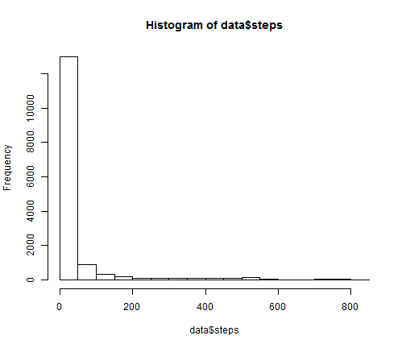
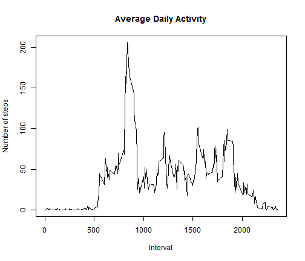
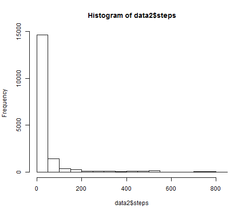
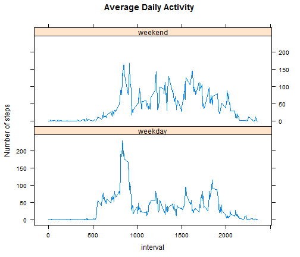

# Reproducible Research: Peer Assessment 1
====================================

## Loading and preprocessing the data

```r
opts_chunk$set(echo = TRUE)
# setwd('./Assessment1')
# download.file('https://d396qusza40orc.cloudfront.net/repdata%2Fdata%2Factivity.zip',
# destfile = 'activity.zip')
unzip("activity.zip")
data.na <- read.csv("activity.csv", header = TRUE)
data <- na.omit(data.na)
```


## What is mean total number of steps taken per day?

```r
hist(data$steps)
```

 

```r
mymean <- mean(data$steps)
mymedian <- median(data$steps)
```

The mean for the total number of steps taken per day is **37.3826** 
 and the median is **0**.

## What is the average daily activity pattern?

```r
avg.steps.interval = aggregate(steps ~ interval, data, mean)
plot(x = avg.steps.interval$interval, y = avg.steps.interval$steps, type = "l", 
    main = "Average Daily Activity", sub = "", xlab = "Interval", ylab = "Number of steps")
```

 

```r
max.interval <- subset(avg.steps.interval, subset = steps == max(avg.steps.interval$steps), 
    select = c(interval))
```

The **835** 5-minute interval, on average across all the days in the dataset, 
 contains the maximum number of steps.

## Imputing missing values

```r
na.count <- sum(is.na(data.na))
```

The total number of missing values are **2304**.

I impute the missing data by using the mean for that 5-minute interval.

```r
library(plyr)
impute.mean <- function(x) replace(x, is.na(x), mean(x, na.rm = TRUE))
data2 <- ddply(data.na, ~interval, transform, steps = impute.mean(steps))
data2 <- data2[order(data2$date, data2$interval), ]  #plyr orders by group so we have to reorder
hist(data2$steps)
```

 

```r
mymean2 <- mean(data2$steps)
mymedian2 <- median(data2$steps)
```

The mean for the total number of steps taken per day is **37.3826** 
 and the median is **0**. 
These values do **not** differ from the estimates from the first part of the assignment.
There was **no impact** when imputing missing data on the estimates of the total daily number of steps.

## Are there differences in activity patterns between weekdays and weekends?

```r
data2$weekday <- as.factor(ifelse(weekdays(as.Date(data2$date)) %in% c("Saturday", 
    "Sunday"), "weekend", "weekday"))
avg.steps.interval2 = aggregate(steps ~ interval + weekday, data2, mean)

library(lattice)
xyplot(avg.steps.interval2$steps ~ avg.steps.interval2$interval | avg.steps.interval2$weekday, 
    type = "l", layout = (c(1, 2)), main = "Average Daily Activity", ylab = "Number of steps", 
    xlab = "interval")
```

 


